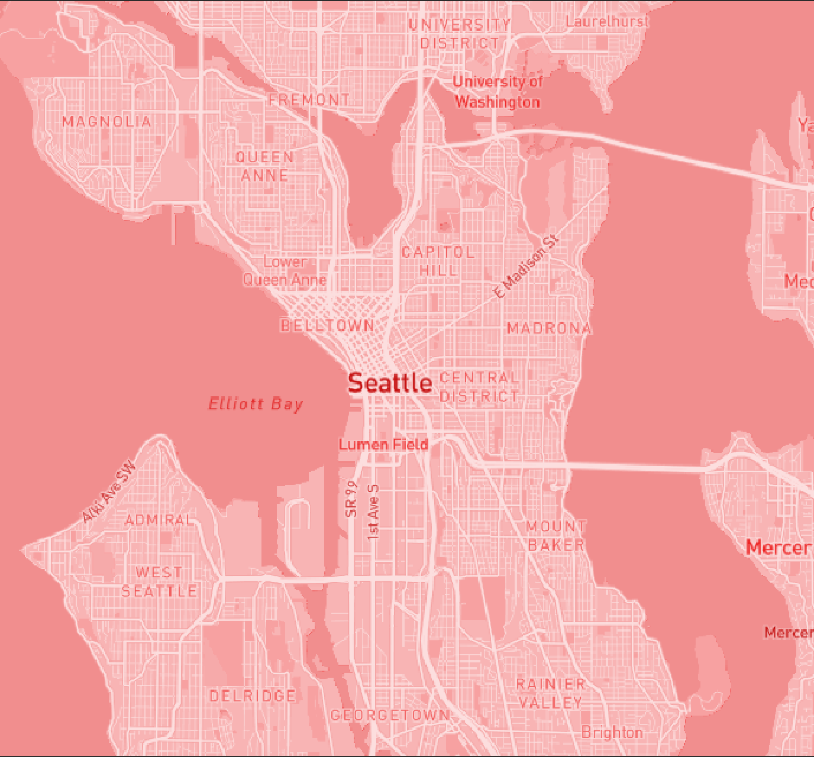
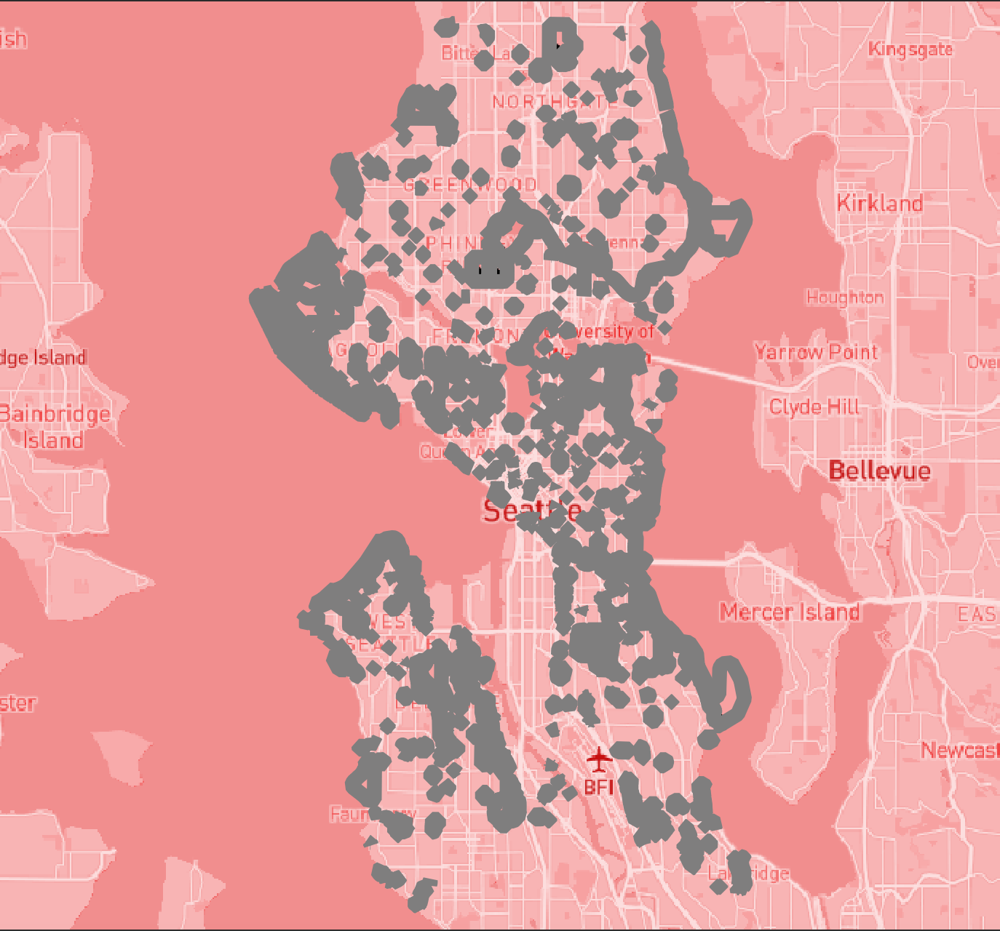

# Map Design and Tile Generation (Lab 4)
GEOG 458
By: Minttu Welander

## Project Overview
This project showcases four maps with generated tiles on a Mapbox baselayer. The interactive map can be found [here](https://mintwel.github.io/TileGenerationLab/index.html).

## Map Layers
### Tile Set 1 with Modified Basemap
This map showcases the basemap using Mapbox's monochrome basemap. It is focused on the Seattle area and showcases the geographic features of the area.

Basemap: Monochrome Bubblegum from Mapbox
Geography: Seattle, WA

### Thematic Tile Set 2 with Basemap
This map showcases the park areas in Seattle. I personally love spending time in parks and wanted to show all of the park locations in the Seattle area. Here it also becomes apparent how many parks Seattle really has!

Basemap: Monochrome Bubblegum from Mapbox
Geography: Seattle, WA

### Thematic Tile Set 3 with Basemap
img
Basemap: Monochrome Bubblegum from Mapbox
Geography: Seattle, WA

### Thematic Tile Set 4 with Basemap
img
Basemap: Monochrome Bubblegum from Mapbox
Geography: Seattle, WA

## Data Sources and Credits
CSV data from:
Basemap from Mapbox
