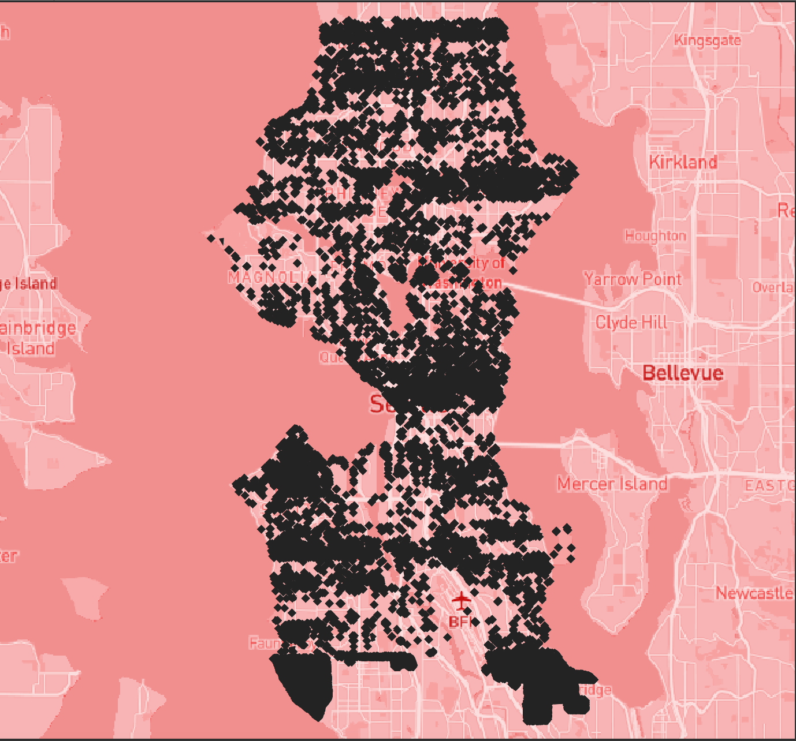
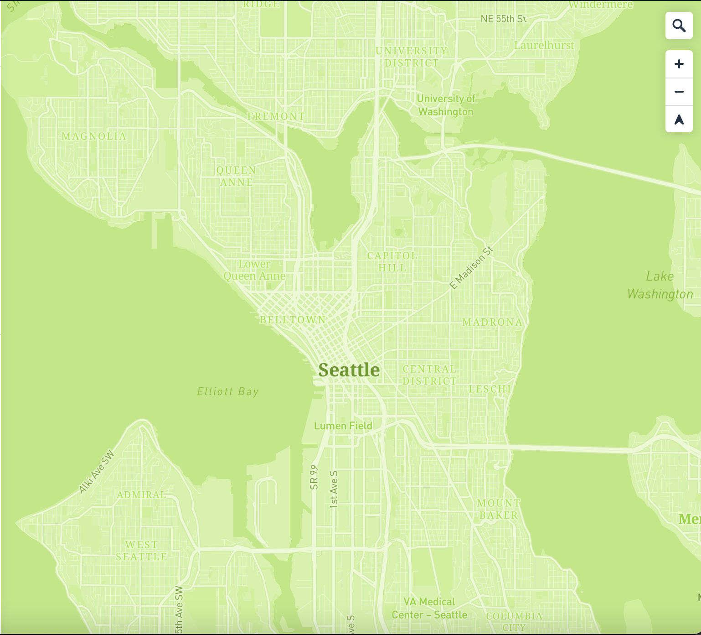

# Map Design and Tile Generation (Lab 4)
GEOG 458
By: Minttu Welander

## Project Overview
This project showcases four maps with generated tiles on a Mapbox baselayer. All four maps follow an environmental theme. The interactive map can be found [here](https://mintwel.github.io/TileGenerationLab/index.html).

## Map Layers
### Tile Set 1 with Modified Basemap
Map Descritption: This map showcases the basemap using Mapbox's monochrome basemap. It is focused on the Seattle area and showcases the geographic features of the area.

Basemap: Monochrome Bubblegum from Mapbox

Zoom Level: Min - 1, Max - 13

Geography: Seattle, WA

### Thematic Tile Set 2 with Basemap
Map Description: This map showcases the park areas in Seattle. I personally love spending time in parks and wanted to show all of the park locations in the Seattle area. Here it also becomes apparent how many parks Seattle really has!

Basemap: Monochrome Bubblegum from Mapbox

Zoom Level: Min - 1, Max - 13

Geography: Seattle, WA

### Thematic Tile Set 3 with Basemap
Map Description: This map looks at the tree canopy coverage in Seattle! It is a beautiful representation of how green our city is!

Basemap: Monochrome Bubblegum from Mapbox

Zoom Level: Min - 1, Max - 13

Geography: Seattle, WA

### Thematic Tile Set 4 with Basemap
Map Description: This map is a thematic map of Seattle in the color green to exemplify the environmental theme of the tile maps!

Basemap: Monochrome Bubblegum from Mapbox

Zoom Level: Min - 1, Max - 13

Geography: Seattle, WA

## Data Sources and Credits
Shapefiles for tree canopy and park data in Seattle from the [City of Seattle](https://data-seattlecitygis.opendata.arcgis.com/)
Basemap from [Mapbox](https://www.mapbox.com/)
