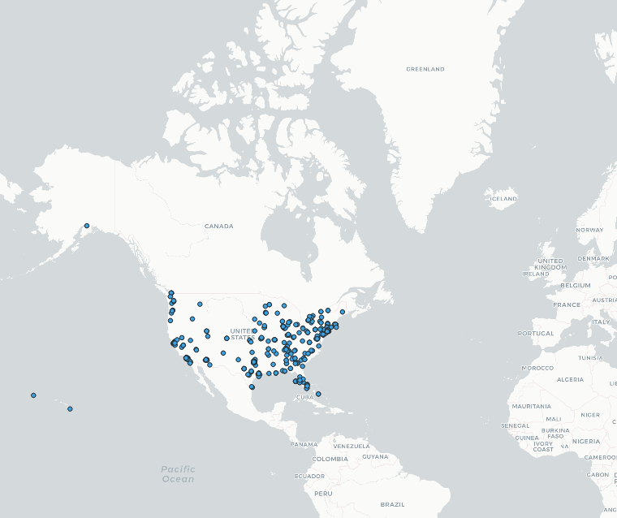
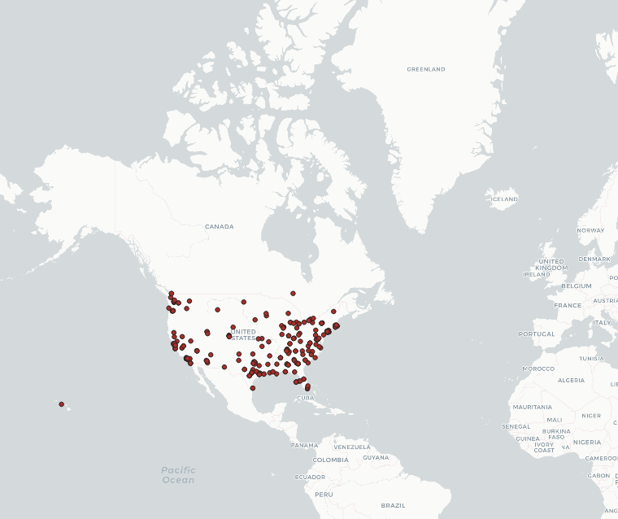
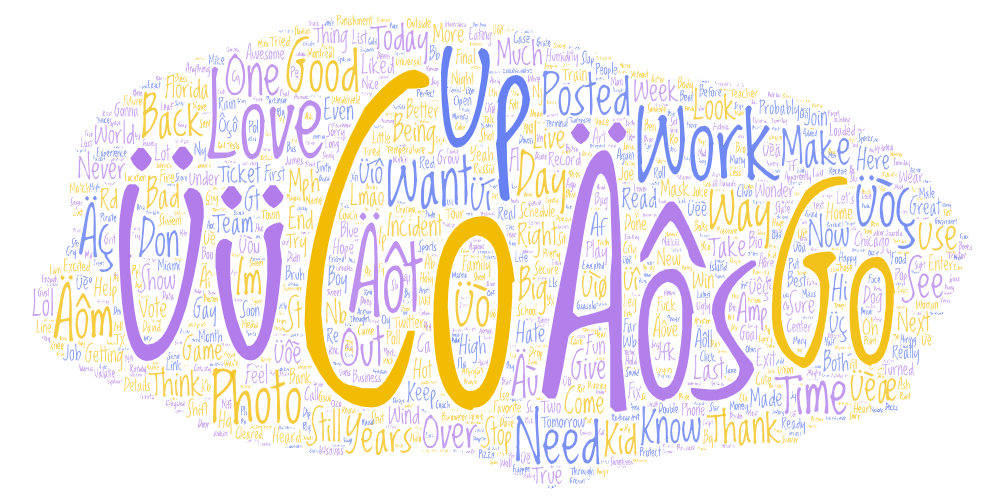

In this lab, I chose to compare geo-tagged tweets from the same region (the 
continental United States as well as Hawaii and Alaska) in two time periods. The
first time period was in the morning of April 21st 2022, and the second one was 
the evening of the same day. I chose to do this in order to see how the tweets 
from the same geographic region changed depending on the time of day!

Ultimately, I found that the change in the geo-tagged tweets between morning and
evening was not all that noticeable. I had been anticipating seeing a higher
rate of geo-tagged tweets from the east coast of the United States in the morning,
and fewer in the evening, as I figured it would follow the time difference between
the two. However, the results were much more ambiguous than my initial hypothesis.

For example, the first map showed this:

As you can see, there is a significant concentration of geo-tagged tweets
on the East Coast.

However, looking at the second map from the evening, it is similar here as well.
Therefore, although there was an initial concentration of geo-tagged tweets in the
East Coast of the continental United States, it did not follow the time zone hypothesis that
I had put forth. Instead, it is more likely that the tweets are concentrated there
because of a higher population.

Looking at the word clouds, I found similar language as well.

In the first word cloud, shown here above, many of the most popular words do not
seem to be words in the English language at all. I found this very interesting, considering
that the words shown here in the biggest font were the most popular words as well.
Therefore, many of the most popular words from the tweets from the morning seem to have
been tweeted using the same words that are either from a different language, or 
perhaps they mean something that I am simply unaware of.

The second word cloud, shown above, also had words that were unknown to me, but 
at a lesser frequency. The second word cloud, from the evening, did not seem to have
any words that strongly showcased a difference in time, but rather seemed to follow
a similar pattern from the morning.

Ultimately, I did not find significant differences in the geo-tagged tweets from the
morning and evening, but rather a semi-random selection of tweets and ideas from different
people and places going about their days.
